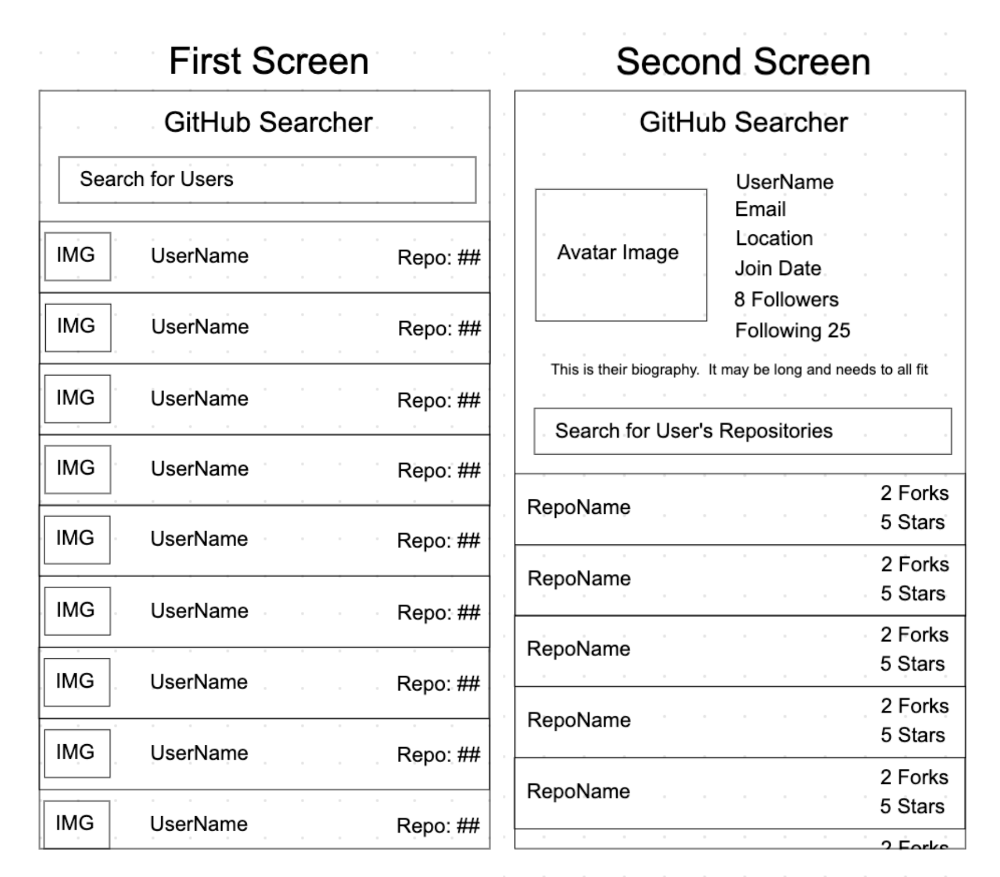

# GitHub Users API
This project aims to fullfill all T-Mobile coding assigment.

This app is built based on the following criteria:  

## Criteria: 
- Built on MVVM architectureal pattern.
- Is natively built on Swift 5.1 and iOS Developemnt Target 13.0 and not used any third-party libraries.
- Is able to search through GitHub users and their corresponding projects using the GitHub API: [https://developer.github.com/v3/](). 
- The application shall contain 2 scenes with the following specifications: 
	1. **The first scene**: 
		- Uses UITableView showing one user per table cell.
		- Each table cell item should contain the avatar image, username, and the number of repositories they have. 
		- Will contain a search bar that can search through any user on the GitHub website at the top with a list of results underneath.
		- The list view shall not be paginated.
		- The search will automatically update upon each letter entered.
		- Tapping on a user will bring up a screen that contains the profile details of that user, aka displaying the second view.
	
	2. **The second scene**: will separate into 2 parts: 

	
		a. The first part (the top half of the scene): 
			- The view should contain their avatar image (a larger image) on the top left corner.
			- Right next the avatar image, display the following info: username, number of followers, number of following, biography, email, location, join date, and a list of public repositories.
			- Each item of the list view shall contain the name of the repository, the number of stars, and the number of forks.
			- The search bar will allow the user to search through the user’s repository. 

		b. The second part (the bottom half of the scene): 
			- Display the list view of all repos of the selected user profile.
			- The list view shall not be paginated.
			- The search will automatically update upon each letter entered.
			- Tapping on a repository shall bring to a web browser and open the repository in the GitHub website.
## Bluprint:

		
		
## Extra Features:
- Get infinite scrolling working for the first screen.
- Error handling with meaningful messages in cases: 
	- reaching Rate limit from GitHub API documentation.
	- fetch data with missing result.
	- return fetched resull with https status codes for futher insight of error.